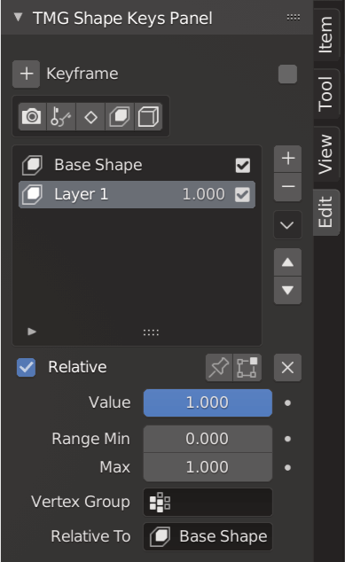

# tmg-mod-tools (blender 2.8x addon) 
#### Modify multiple objects, sculpt tools, and various features to help use Blender.

#### current version is supported for Blender 2.83

### Alpha Release zip here -> 

### youtube video showing what it can do -> 

### TMG-Mod-Tools v0.2.3-Alpha Features
https://youtu.be/-rwkOdRscCM

### TMG-Mod-Tools v0.1.9-Alpha-1 Demo
https://youtu.be/xaKq91LFCfI

### TMG-Mod-Tools v0.1.8-alpha-3
https://youtu.be/Bu4R8NCpvQw

### TMG_Mod_Tools v0.1.8 live update slider test
https://youtu.be/vagXWfk5gwE

### TMG_Mod_Tools v0.1.6 alpha Guide / Tutorial
https://youtu.be/nr9dIqI0Ll4
                        
### Decimate_Tools Update #3
https://youtu.be/D8FJvBc65Lk

### Object-Mode Panel Preview

### Edit-Mode Panel Preview

### Sculpt Panel Preview

