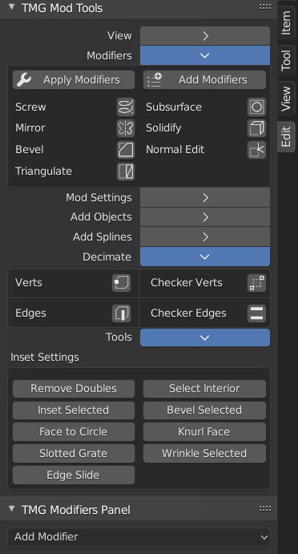
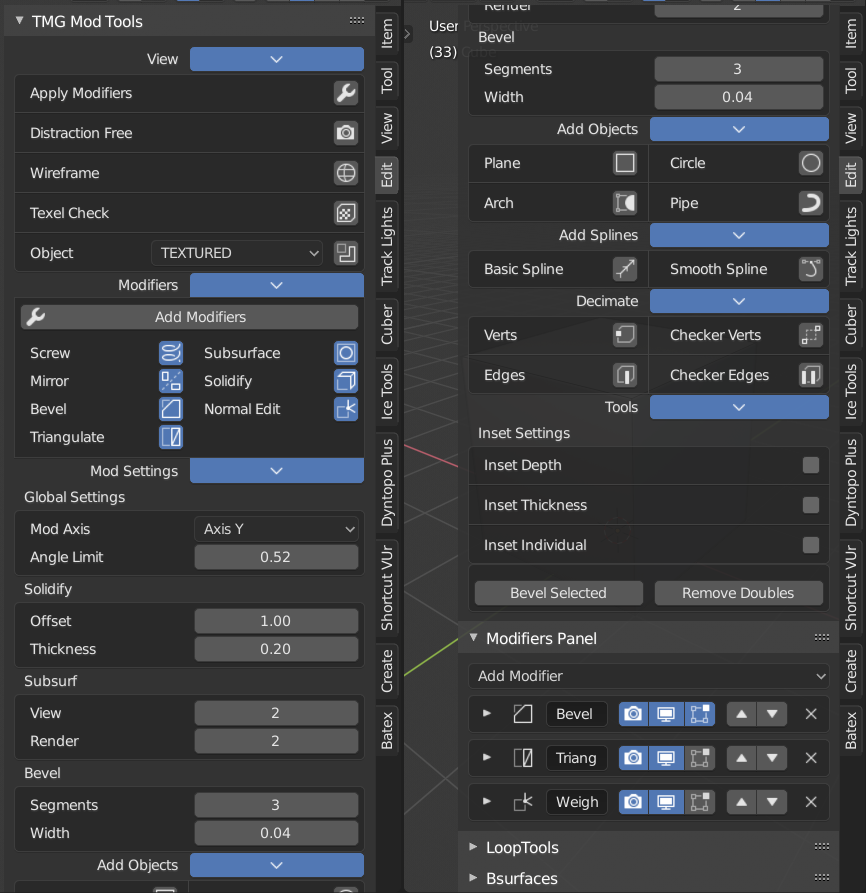

# (blender) tmg-mod-tools
#### Adding various mesh decimation, add object, and modifier tools to the Edit Panel.

#### current version is supported for Blender 2.80 (stable)

### Alpha Release zip here -> 

### youtube video showing what it can do -> 

https://youtu.be/D8FJvBc65Lk

